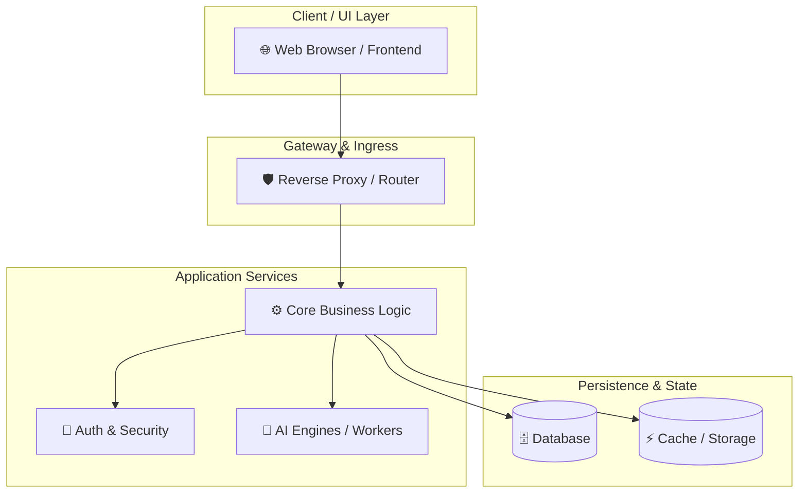

# 🗺️ Interactive Architecture Map: ExpenseAI

> Clickable architecture visualization (Archify style). All sensitive keys are redacted.

## 📂 Clickable File & Component Navigator

| Component / Module | Relative Path | Direct File Link |
|---|---|---|
| `ARCHITECTURE_MAP.md` | `ARCHITECTURE_MAP.md` | [ARCHITECTURE_MAP.md](file:///C:/Users/dathao/Downloads/AI/ExpenseAI/ARCHITECTURE_MAP.md) |
| `CHANGELOG.md` | `CHANGELOG.md` | [CHANGELOG.md](file:///C:/Users/dathao/Downloads/AI/ExpenseAI/CHANGELOG.md) |
| `CODE_OF_CONDUCT.md` | `CODE_OF_CONDUCT.md` | [CODE_OF_CONDUCT.md](file:///C:/Users/dathao/Downloads/AI/ExpenseAI/CODE_OF_CONDUCT.md) |
| `CONTRIBUTING.md` | `CONTRIBUTING.md` | [CONTRIBUTING.md](file:///C:/Users/dathao/Downloads/AI/ExpenseAI/CONTRIBUTING.md) |
| `DESIGN.md` | `DESIGN.md` | [DESIGN.md](file:///C:/Users/dathao/Downloads/AI/ExpenseAI/DESIGN.md) |
| `README.md` | `README.md` | [README.md](file:///C:/Users/dathao/Downloads/AI/ExpenseAI/README.md) |
| `SECURITY.md` | `SECURITY.md` | [SECURITY.md](file:///C:/Users/dathao/Downloads/AI/ExpenseAI/SECURITY.md) |
| `docker-compose.yml` | `docker-compose.yml` | [docker-compose.yml](file:///C:/Users/dathao/Downloads/AI/ExpenseAI/docker-compose.yml) |
| `install.bat` | `install.bat` | [install.bat](file:///C:/Users/dathao/Downloads/AI/ExpenseAI/install.bat) |
| `run_web.bat` | `run_web.bat` | [run_web.bat](file:///C:/Users/dathao/Downloads/AI/ExpenseAI/run_web.bat) |
| `seed_6_months.py` | `seed_6_months.py` | [seed_6_months.py](file:///C:/Users/dathao/Downloads/AI/ExpenseAI/seed_6_months.py) |
| `seed_data.py` | `seed_data.py` | [seed_data.py](file:///C:/Users/dathao/Downloads/AI/ExpenseAI/seed_data.py) |
| `stop_web.bat` | `stop_web.bat` | [stop_web.bat](file:///C:/Users/dathao/Downloads/AI/ExpenseAI/stop_web.bat) |
| `env.py` | `backend\alembic\env.py` | [env.py](file:///C:/Users/dathao/Downloads/AI/ExpenseAI/backend/alembic/env.py) |
| `75ef7e205ba6_create_application_schema.py` | `backend\alembic\versions\75ef7e205ba6_create_application_schema.py` | [75ef7e205ba6_create_application_schema.py](file:///C:/Users/dathao/Downloads/AI/ExpenseAI/backend/alembic/versions/75ef7e205ba6_create_application_schema.py) |
| `__init__.py` | `backend\scripts\__init__.py` | [__init__.py](file:///C:/Users/dathao/Downloads/AI/ExpenseAI/backend/scripts/__init__.py) |
| `build_academic_docx.py` | `backend\scripts\build_academic_docx.py` | [build_academic_docx.py](file:///C:/Users/dathao/Downloads/AI/ExpenseAI/backend/scripts/build_academic_docx.py) |
| `build_exact_3_reports_docx.py` | `backend\scripts\build_exact_3_reports_docx.py` | [build_exact_3_reports_docx.py](file:///C:/Users/dathao/Downloads/AI/ExpenseAI/backend/scripts/build_exact_3_reports_docx.py) |
| `build_official_technical_report.py` | `backend\scripts\build_official_technical_report.py` | [build_official_technical_report.py](file:///C:/Users/dathao/Downloads/AI/ExpenseAI/backend/scripts/build_official_technical_report.py) |
| `build_script_docx.py` | `backend\scripts\build_script_docx.py` | [build_script_docx.py](file:///C:/Users/dathao/Downloads/AI/ExpenseAI/backend/scripts/build_script_docx.py) |
| `cleanup_categories.py` | `backend\scripts\cleanup_categories.py` | [cleanup_categories.py](file:///C:/Users/dathao/Downloads/AI/ExpenseAI/backend/scripts/cleanup_categories.py) |
| `convert_to_docx.py` | `backend\scripts\convert_to_docx.py` | [convert_to_docx.py](file:///C:/Users/dathao/Downloads/AI/ExpenseAI/backend/scripts/convert_to_docx.py) |
| `fix_db.py` | `backend\scripts\fix_db.py` | [fix_db.py](file:///C:/Users/dathao/Downloads/AI/ExpenseAI/backend/scripts/fix_db.py) |
| `fix_wireframe_in_backup_docx.py` | `backend\scripts\fix_wireframe_in_backup_docx.py` | [fix_wireframe_in_backup_docx.py](file:///C:/Users/dathao/Downloads/AI/ExpenseAI/backend/scripts/fix_wireframe_in_backup_docx.py) |
| `generate_report.py` | `backend\scripts\generate_report.py` | [generate_report.py](file:///C:/Users/dathao/Downloads/AI/ExpenseAI/backend/scripts/generate_report.py) |
| `generate_sharp_diagrams.py` | `backend\scripts\generate_sharp_diagrams.py` | [generate_sharp_diagrams.py](file:///C:/Users/dathao/Downloads/AI/ExpenseAI/backend/scripts/generate_sharp_diagrams.py) |
| `generate_slide_deck_pptx.py` | `backend\scripts\generate_slide_deck_pptx.py` | [generate_slide_deck_pptx.py](file:///C:/Users/dathao/Downloads/AI/ExpenseAI/backend/scripts/generate_slide_deck_pptx.py) |
| `generate_testing_report.py` | `backend\scripts\generate_testing_report.py` | [generate_testing_report.py](file:///C:/Users/dathao/Downloads/AI/ExpenseAI/backend/scripts/generate_testing_report.py) |
| `generate_thesis_report.py` | `backend\scripts\generate_thesis_report.py` | [generate_thesis_report.py](file:///C:/Users/dathao/Downloads/AI/ExpenseAI/backend/scripts/generate_thesis_report.py) |
| `init_db.py` | `backend\scripts\init_db.py` | [init_db.py](file:///C:/Users/dathao/Downloads/AI/ExpenseAI/backend/scripts/init_db.py) |
| `init_rbac.py` | `backend\scripts\init_rbac.py` | [init_rbac.py](file:///C:/Users/dathao/Downloads/AI/ExpenseAI/backend/scripts/init_rbac.py) |
| `seed_data.py` | `backend\scripts\seed_data.py` | [seed_data.py](file:///C:/Users/dathao/Downloads/AI/ExpenseAI/backend/scripts/seed_data.py) |
| `seed_feedback.py` | `backend\scripts\seed_feedback.py` | [seed_feedback.py](file:///C:/Users/dathao/Downloads/AI/ExpenseAI/backend/scripts/seed_feedback.py) |
| `seed_transactions.py` | `backend\scripts\seed_transactions.py` | [seed_transactions.py](file:///C:/Users/dathao/Downloads/AI/ExpenseAI/backend/scripts/seed_transactions.py) |
| `update_docx_diagrams.py` | `backend\scripts\update_docx_diagrams.py` | [update_docx_diagrams.py](file:///C:/Users/dathao/Downloads/AI/ExpenseAI/backend/scripts/update_docx_diagrams.py) |
| `verify_docx_layout.py` | `backend\scripts\verify_docx_layout.py` | [verify_docx_layout.py](file:///C:/Users/dathao/Downloads/AI/ExpenseAI/backend/scripts/verify_docx_layout.py) |
| `verify_e2e.py` | `backend\scripts\verify_e2e.py` | [verify_e2e.py](file:///C:/Users/dathao/Downloads/AI/ExpenseAI/backend/scripts/verify_e2e.py) |
| `__init__.py` | `backend\src\__init__.py` | [__init__.py](file:///C:/Users/dathao/Downloads/AI/ExpenseAI/backend/src/__init__.py) |
| `config.py` | `backend\src\config.py` | [config.py](file:///C:/Users/dathao/Downloads/AI/ExpenseAI/backend/src/config.py) |
| `database.py` | `backend\src\database.py` | [database.py](file:///C:/Users/dathao/Downloads/AI/ExpenseAI/backend/src/database.py) |
| `main.py` | `backend\src\main.py` | [main.py](file:///C:/Users/dathao/Downloads/AI/ExpenseAI/backend/src/main.py) |
| `__init__.py` | `backend\src\api\__init__.py` | [__init__.py](file:///C:/Users/dathao/Downloads/AI/ExpenseAI/backend/src/api/__init__.py) |
| `admin.py` | `backend\src\api\admin.py` | [admin.py](file:///C:/Users/dathao/Downloads/AI/ExpenseAI/backend/src/api/admin.py) |
| `advice.py` | `backend\src\api\advice.py` | [advice.py](file:///C:/Users/dathao/Downloads/AI/ExpenseAI/backend/src/api/advice.py) |
| `auth.py` | `backend\src\api\auth.py` | [auth.py](file:///C:/Users/dathao/Downloads/AI/ExpenseAI/backend/src/api/auth.py) |
| `budgets.py` | `backend\src\api\budgets.py` | [budgets.py](file:///C:/Users/dathao/Downloads/AI/ExpenseAI/backend/src/api/budgets.py) |
| `categories.py` | `backend\src\api\categories.py` | [categories.py](file:///C:/Users/dathao/Downloads/AI/ExpenseAI/backend/src/api/categories.py) |
| `dashboard.py` | `backend\src\api\dashboard.py` | [dashboard.py](file:///C:/Users/dathao/Downloads/AI/ExpenseAI/backend/src/api/dashboard.py) |
| `feedback.py` | `backend\src\api\feedback.py` | [feedback.py](file:///C:/Users/dathao/Downloads/AI/ExpenseAI/backend/src/api/feedback.py) |
| `reports.py` | `backend\src\api\reports.py` | [reports.py](file:///C:/Users/dathao/Downloads/AI/ExpenseAI/backend/src/api/reports.py) |
| `transactions.py` | `backend\src\api\transactions.py` | [transactions.py](file:///C:/Users/dathao/Downloads/AI/ExpenseAI/backend/src/api/transactions.py) |
| `web.py` | `backend\src\api\web.py` | [web.py](file:///C:/Users/dathao/Downloads/AI/ExpenseAI/backend/src/api/web.py) |
| `csrf.py` | `backend\src\middleware\csrf.py` | [csrf.py](file:///C:/Users/dathao/Downloads/AI/ExpenseAI/backend/src/middleware/csrf.py) |
| `logging.py` | `backend\src\middleware\logging.py` | [logging.py](file:///C:/Users/dathao/Downloads/AI/ExpenseAI/backend/src/middleware/logging.py) |
| `__init__.py` | `backend\src\models\__init__.py` | [__init__.py](file:///C:/Users/dathao/Downloads/AI/ExpenseAI/backend/src/models/__init__.py) |
| `ai_prediction.py` | `backend\src\models\ai_prediction.py` | [ai_prediction.py](file:///C:/Users/dathao/Downloads/AI/ExpenseAI/backend/src/models/ai_prediction.py) |
| `budget.py` | `backend\src\models\budget.py` | [budget.py](file:///C:/Users/dathao/Downloads/AI/ExpenseAI/backend/src/models/budget.py) |
| `category.py` | `backend\src\models\category.py` | [category.py](file:///C:/Users/dathao/Downloads/AI/ExpenseAI/backend/src/models/category.py) |
| `feedback.py` | `backend\src\models\feedback.py` | [feedback.py](file:///C:/Users/dathao/Downloads/AI/ExpenseAI/backend/src/models/feedback.py) |
| `rbac.py` | `backend\src\models\rbac.py` | [rbac.py](file:///C:/Users/dathao/Downloads/AI/ExpenseAI/backend/src/models/rbac.py) |
| `transaction.py` | `backend\src\models\transaction.py` | [transaction.py](file:///C:/Users/dathao/Downloads/AI/ExpenseAI/backend/src/models/transaction.py) |
| `user.py` | `backend\src\models\user.py` | [user.py](file:///C:/Users/dathao/Downloads/AI/ExpenseAI/backend/src/models/user.py) |
| `user_memory_rule.py` | `backend\src\models\user_memory_rule.py` | [user_memory_rule.py](file:///C:/Users/dathao/Downloads/AI/ExpenseAI/backend/src/models/user_memory_rule.py) |
| `__init__.py` | `backend\src\schemas\__init__.py` | [__init__.py](file:///C:/Users/dathao/Downloads/AI/ExpenseAI/backend/src/schemas/__init__.py) |
| `budget.py` | `backend\src\schemas\budget.py` | [budget.py](file:///C:/Users/dathao/Downloads/AI/ExpenseAI/backend/src/schemas/budget.py) |
| `category.py` | `backend\src\schemas\category.py` | [category.py](file:///C:/Users/dathao/Downloads/AI/ExpenseAI/backend/src/schemas/category.py) |
| `dashboard.py` | `backend\src\schemas\dashboard.py` | [dashboard.py](file:///C:/Users/dathao/Downloads/AI/ExpenseAI/backend/src/schemas/dashboard.py) |
| `feedback.py` | `backend\src\schemas\feedback.py` | [feedback.py](file:///C:/Users/dathao/Downloads/AI/ExpenseAI/backend/src/schemas/feedback.py) |
| `transaction.py` | `backend\src\schemas\transaction.py` | [transaction.py](file:///C:/Users/dathao/Downloads/AI/ExpenseAI/backend/src/schemas/transaction.py) |
| `user.py` | `backend\src\schemas\user.py` | [user.py](file:///C:/Users/dathao/Downloads/AI/ExpenseAI/backend/src/schemas/user.py) |
| `__init__.py` | `backend\src\services\__init__.py` | [__init__.py](file:///C:/Users/dathao/Downloads/AI/ExpenseAI/backend/src/services/__init__.py) |
| `ai_advice.py` | `backend\src\services\ai_advice.py` | [ai_advice.py](file:///C:/Users/dathao/Downloads/AI/ExpenseAI/backend/src/services/ai_advice.py) |
| `ai_behavior.py` | `backend\src\services\ai_behavior.py` | [ai_behavior.py](file:///C:/Users/dathao/Downloads/AI/ExpenseAI/backend/src/services/ai_behavior.py) |
| `ai_classifier.py` | `backend\src\services\ai_classifier.py` | [ai_classifier.py](file:///C:/Users/dathao/Downloads/AI/ExpenseAI/backend/src/services/ai_classifier.py) |
| `ai_vision.py` | `backend\src\services\ai_vision.py` | [ai_vision.py](file:///C:/Users/dathao/Downloads/AI/ExpenseAI/backend/src/services/ai_vision.py) |
| `__init__.py` | `backend\src\utils\__init__.py` | [__init__.py](file:///C:/Users/dathao/Downloads/AI/ExpenseAI/backend/src/utils/__init__.py) |
| `ai_key_manager.py` | `backend\src\utils\ai_key_manager.py` | [ai_key_manager.py](file:///C:/Users/dathao/Downloads/AI/ExpenseAI/backend/src/utils/ai_key_manager.py) |
| `dependencies.py` | `backend\src\utils\dependencies.py` | [dependencies.py](file:///C:/Users/dathao/Downloads/AI/ExpenseAI/backend/src/utils/dependencies.py) |
| `limiter.py` | `backend\src\utils\limiter.py` | [limiter.py](file:///C:/Users/dathao/Downloads/AI/ExpenseAI/backend/src/utils/limiter.py) |
| `security.py` | `backend\src\utils\security.py` | [security.py](file:///C:/Users/dathao/Downloads/AI/ExpenseAI/backend/src/utils/security.py) |
| `__init__.py` | `backend\tests\__init__.py` | [__init__.py](file:///C:/Users/dathao/Downloads/AI/ExpenseAI/backend/tests/__init__.py) |
| `conftest.py` | `backend\tests\conftest.py` | [conftest.py](file:///C:/Users/dathao/Downloads/AI/ExpenseAI/backend/tests/conftest.py) |
| `test_agent_memory.py` | `backend\tests\test_agent_memory.py` | [test_agent_memory.py](file:///C:/Users/dathao/Downloads/AI/ExpenseAI/backend/tests/test_agent_memory.py) |
| `test_ai_and_deduplication.py` | `backend\tests\test_ai_and_deduplication.py` | [test_ai_and_deduplication.py](file:///C:/Users/dathao/Downloads/AI/ExpenseAI/backend/tests/test_ai_and_deduplication.py) |
| `test_api.py` | `backend\tests\test_api.py` | [test_api.py](file:///C:/Users/dathao/Downloads/AI/ExpenseAI/backend/tests/test_api.py) |
| `test_budgets.py` | `backend\tests\test_budgets.py` | [test_budgets.py](file:///C:/Users/dathao/Downloads/AI/ExpenseAI/backend/tests/test_budgets.py) |
| `test_export.py` | `backend\tests\test_export.py` | [test_export.py](file:///C:/Users/dathao/Downloads/AI/ExpenseAI/backend/tests/test_export.py) |
| `test_feedback.py` | `backend\tests\test_feedback.py` | [test_feedback.py](file:///C:/Users/dathao/Downloads/AI/ExpenseAI/backend/tests/test_feedback.py) |
| `test_gemini_failover.py` | `backend\tests\test_gemini_failover.py` | [test_gemini_failover.py](file:///C:/Users/dathao/Downloads/AI/ExpenseAI/backend/tests/test_gemini_failover.py) |
| `test_security_fixes.py` | `backend\tests\test_security_fixes.py` | [test_security_fixes.py](file:///C:/Users/dathao/Downloads/AI/ExpenseAI/backend/tests/test_security_fixes.py) |
| `style.css` | `frontend\static\css\style.css` | [style.css](file:///C:/Users/dathao/Downloads/AI/ExpenseAI/frontend/static/css/style.css) |
| `transitions.css` | `frontend\static\css\transitions.css` | [transitions.css](file:///C:/Users/dathao/Downloads/AI/ExpenseAI/frontend/static/css/transitions.css) |
| `admin.html` | `frontend\templates\admin.html` | [admin.html](file:///C:/Users/dathao/Downloads/AI/ExpenseAI/frontend/templates/admin.html) |
| `base.html` | `frontend\templates\base.html` | [base.html](file:///C:/Users/dathao/Downloads/AI/ExpenseAI/frontend/templates/base.html) |
| `budgets.html` | `frontend\templates\budgets.html` | [budgets.html](file:///C:/Users/dathao/Downloads/AI/ExpenseAI/frontend/templates/budgets.html) |
| `categories.html` | `frontend\templates\categories.html` | [categories.html](file:///C:/Users/dathao/Downloads/AI/ExpenseAI/frontend/templates/categories.html) |
| `dashboard.html` | `frontend\templates\dashboard.html` | [dashboard.html](file:///C:/Users/dathao/Downloads/AI/ExpenseAI/frontend/templates/dashboard.html) |
| `feedback.html` | `frontend\templates\feedback.html` | [feedback.html](file:///C:/Users/dathao/Downloads/AI/ExpenseAI/frontend/templates/feedback.html) |
| `login.html` | `frontend\templates\login.html` | [login.html](file:///C:/Users/dathao/Downloads/AI/ExpenseAI/frontend/templates/login.html) |
| `register.html` | `frontend\templates\register.html` | [register.html](file:///C:/Users/dathao/Downloads/AI/ExpenseAI/frontend/templates/register.html) |
| `settings.html` | `frontend\templates\settings.html` | [settings.html](file:///C:/Users/dathao/Downloads/AI/ExpenseAI/frontend/templates/settings.html) |
| `stats.html` | `frontend\templates\stats.html` | [stats.html](file:///C:/Users/dathao/Downloads/AI/ExpenseAI/frontend/templates/stats.html) |
| `support.html` | `frontend\templates\support.html` | [support.html](file:///C:/Users/dathao/Downloads/AI/ExpenseAI/frontend/templates/support.html) |
| `transaction_form.html` | `frontend\templates\transaction_form.html` | [transaction_form.html](file:///C:/Users/dathao/Downloads/AI/ExpenseAI/frontend/templates/transaction_form.html) |
| `transactions.html` | `frontend\templates\transactions.html` | [transactions.html](file:///C:/Users/dathao/Downloads/AI/ExpenseAI/frontend/templates/transactions.html) |
| `check_db.py` | `scratch\check_db.py` | [check_db.py](file:///C:/Users/dathao/Downloads/AI/ExpenseAI/scratch/check_db.py) |
| `debug_html.py` | `scratch\debug_html.py` | [debug_html.py](file:///C:/Users/dathao/Downloads/AI/ExpenseAI/scratch/debug_html.py) |
| `README.md` | `scratch\transitions_repo\README.md` | [README.md](file:///C:/Users/dathao/Downloads/AI/ExpenseAI/scratch/transitions_repo/README.md) |
| `account.html` | `scratch\transitions_repo\account.html` | [account.html](file:///C:/Users/dathao/Downloads/AI/ExpenseAI/scratch/transitions_repo/account.html) |
| `activate.html` | `scratch\transitions_repo\activate.html` | [activate.html](file:///C:/Users/dathao/Downloads/AI/ExpenseAI/scratch/transitions_repo/activate.html) |
| `article.html` | `scratch\transitions_repo\article.html` | [article.html](file:///C:/Users/dathao/Downloads/AI/ExpenseAI/scratch/transitions_repo/article.html) |
| `collection.html` | `scratch\transitions_repo\collection.html` | [collection.html](file:///C:/Users/dathao/Downloads/AI/ExpenseAI/scratch/transitions_repo/collection.html) |
| `demo2.html` | `scratch\transitions_repo\demo2.html` | [demo2.html](file:///C:/Users/dathao/Downloads/AI/ExpenseAI/scratch/transitions_repo/demo2.html) |
| `detail.html` | `scratch\transitions_repo\detail.html` | [detail.html](file:///C:/Users/dathao/Downloads/AI/ExpenseAI/scratch/transitions_repo/detail.html) |
| `example-dropdown.html` | `scratch\transitions_repo\example-dropdown.html` | [example-dropdown.html](file:///C:/Users/dathao/Downloads/AI/ExpenseAI/scratch/transitions_repo/example-dropdown.html) |
| `example.html` | `scratch\transitions_repo\example.html` | [example.html](file:///C:/Users/dathao/Downloads/AI/ExpenseAI/scratch/transitions_repo/example.html) |
| `index.html` | `scratch\transitions_repo\index.html` | [index.html](file:///C:/Users/dathao/Downloads/AI/ExpenseAI/scratch/transitions_repo/index.html) |
| `package.json` | `scratch\transitions_repo\package.json` | [package.json](file:///C:/Users/dathao/Downloads/AI/ExpenseAI/scratch/transitions_repo/package.json) |
| `privacy.html` | `scratch\transitions_repo\privacy.html` | [privacy.html](file:///C:/Users/dathao/Downloads/AI/ExpenseAI/scratch/transitions_repo/privacy.html) |
| `pro.html` | `scratch\transitions_repo\pro.html` | [pro.html](file:///C:/Users/dathao/Downloads/AI/ExpenseAI/scratch/transitions_repo/pro.html) |
| `prototypes.html` | `scratch\transitions_repo\prototypes.html` | [prototypes.html](file:///C:/Users/dathao/Downloads/AI/ExpenseAI/scratch/transitions_repo/prototypes.html) |
| `refine-example.html` | `scratch\transitions_repo\refine-example.html` | [refine-example.html](file:///C:/Users/dathao/Downloads/AI/ExpenseAI/scratch/transitions_repo/refine-example.html) |
| `refine.html` | `scratch\transitions_repo\refine.html` | [refine.html](file:///C:/Users/dathao/Downloads/AI/ExpenseAI/scratch/transitions_repo/refine.html) |
| `skill-refine.html` | `scratch\transitions_repo\skill-refine.html` | [skill-refine.html](file:///C:/Users/dathao/Downloads/AI/ExpenseAI/scratch/transitions_repo/skill-refine.html) |
| `skill.html` | `scratch\transitions_repo\skill.html` | [skill.html](file:///C:/Users/dathao/Downloads/AI/ExpenseAI/scratch/transitions_repo/skill.html) |
| `success.html` | `scratch\transitions_repo\success.html` | [success.html](file:///C:/Users/dathao/Downloads/AI/ExpenseAI/scratch/transitions_repo/success.html) |
| `terms.html` | `scratch\transitions_repo\terms.html` | [terms.html](file:///C:/Users/dathao/Downloads/AI/ExpenseAI/scratch/transitions_repo/terms.html) |
| `website-demo.html` | `scratch\transitions_repo\website-demo.html` | [website-demo.html](file:///C:/Users/dathao/Downloads/AI/ExpenseAI/scratch/transitions_repo/website-demo.html) |
| `pro-client.js` | `scratch\transitions_repo\assets\pro-client.js` | [pro-client.js](file:///C:/Users/dathao/Downloads/AI/ExpenseAI/scratch/transitions_repo/assets/pro-client.js) |
| `README.md` | `scratch\transitions_repo\cli\README.md` | [README.md](file:///C:/Users/dathao/Downloads/AI/ExpenseAI/scratch/transitions_repo/cli/README.md) |
| `free-manifest.json` | `scratch\transitions_repo\cli\free-manifest.json` | [free-manifest.json](file:///C:/Users/dathao/Downloads/AI/ExpenseAI/scratch/transitions_repo/cli/free-manifest.json) |
| `package.json` | `scratch\transitions_repo\cli\package.json` | [package.json](file:///C:/Users/dathao/Downloads/AI/ExpenseAI/scratch/transitions_repo/cli/package.json) |
| `accordion.md` | `scratch\transitions_repo\cli\free\accordion.md` | [accordion.md](file:///C:/Users/dathao/Downloads/AI/ExpenseAI/scratch/transitions_repo/cli/free/accordion.md) |
| `avatar-group-hover.md` | `scratch\transitions_repo\cli\free\avatar-group-hover.md` | [avatar-group-hover.md](file:///C:/Users/dathao/Downloads/AI/ExpenseAI/scratch/transitions_repo/cli/free/avatar-group-hover.md) |
| `banner-stacking.md` | `scratch\transitions_repo\cli\free\banner-stacking.md` | [banner-stacking.md](file:///C:/Users/dathao/Downloads/AI/ExpenseAI/scratch/transitions_repo/cli/free/banner-stacking.md) |
| `card-resize.md` | `scratch\transitions_repo\cli\free\card-resize.md` | [card-resize.md](file:///C:/Users/dathao/Downloads/AI/ExpenseAI/scratch/transitions_repo/cli/free/card-resize.md) |
| `card-tilt.md` | `scratch\transitions_repo\cli\free\card-tilt.md` | [card-tilt.md](file:///C:/Users/dathao/Downloads/AI/ExpenseAI/scratch/transitions_repo/cli/free/card-tilt.md) |
| `checkbox-check.md` | `scratch\transitions_repo\cli\free\checkbox-check.md` | [checkbox-check.md](file:///C:/Users/dathao/Downloads/AI/ExpenseAI/scratch/transitions_repo/cli/free/checkbox-check.md) |
| `error-state-shake.md` | `scratch\transitions_repo\cli\free\error-state-shake.md` | [error-state-shake.md](file:///C:/Users/dathao/Downloads/AI/ExpenseAI/scratch/transitions_repo/cli/free/error-state-shake.md) |
| `icon-swap.md` | `scratch\transitions_repo\cli\free\icon-swap.md` | [icon-swap.md](file:///C:/Users/dathao/Downloads/AI/ExpenseAI/scratch/transitions_repo/cli/free/icon-swap.md) |
| `input-clear-dissolve.md` | `scratch\transitions_repo\cli\free\input-clear-dissolve.md` | [input-clear-dissolve.md](file:///C:/Users/dathao/Downloads/AI/ExpenseAI/scratch/transitions_repo/cli/free/input-clear-dissolve.md) |
| `learn-more-hover.md` | `scratch\transitions_repo\cli\free\learn-more-hover.md` | [learn-more-hover.md](file:///C:/Users/dathao/Downloads/AI/ExpenseAI/scratch/transitions_repo/cli/free/learn-more-hover.md) |
| `like-button.md` | `scratch\transitions_repo\cli\free\like-button.md` | [like-button.md](file:///C:/Users/dathao/Downloads/AI/ExpenseAI/scratch/transitions_repo/cli/free/like-button.md) |
| `matrix-loader.md` | `scratch\transitions_repo\cli\free\matrix-loader.md` | [matrix-loader.md](file:///C:/Users/dathao/Downloads/AI/ExpenseAI/scratch/transitions_repo/cli/free/matrix-loader.md) |
| `menu-dropdown.md` | `scratch\transitions_repo\cli\free\menu-dropdown.md` | [menu-dropdown.md](file:///C:/Users/dathao/Downloads/AI/ExpenseAI/scratch/transitions_repo/cli/free/menu-dropdown.md) |
| `modal.md` | `scratch\transitions_repo\cli\free\modal.md` | [modal.md](file:///C:/Users/dathao/Downloads/AI/ExpenseAI/scratch/transitions_repo/cli/free/modal.md) |
| `notification-badge.md` | `scratch\transitions_repo\cli\free\notification-badge.md` | [notification-badge.md](file:///C:/Users/dathao/Downloads/AI/ExpenseAI/scratch/transitions_repo/cli/free/notification-badge.md) |
| `number-pop-in.md` | `scratch\transitions_repo\cli\free\number-pop-in.md` | [number-pop-in.md](file:///C:/Users/dathao/Downloads/AI/ExpenseAI/scratch/transitions_repo/cli/free/number-pop-in.md) |
| `page-side-by-side.md` | `scratch\transitions_repo\cli\free\page-side-by-side.md` | [page-side-by-side.md](file:///C:/Users/dathao/Downloads/AI/ExpenseAI/scratch/transitions_repo/cli/free/page-side-by-side.md) |
| `panel-reveal.md` | `scratch\transitions_repo\cli\free\panel-reveal.md` | [panel-reveal.md](file:///C:/Users/dathao/Downloads/AI/ExpenseAI/scratch/transitions_repo/cli/free/panel-reveal.md) |
| `plus-menu-morph.md` | `scratch\transitions_repo\cli\free\plus-menu-morph.md` | [plus-menu-morph.md](file:///C:/Users/dathao/Downloads/AI/ExpenseAI/scratch/transitions_repo/cli/free/plus-menu-morph.md) |
| `reasoning-stream.md` | `scratch\transitions_repo\cli\free\reasoning-stream.md` | [reasoning-stream.md](file:///C:/Users/dathao/Downloads/AI/ExpenseAI/scratch/transitions_repo/cli/free/reasoning-stream.md) |
| `shimmer-text.md` | `scratch\transitions_repo\cli\free\shimmer-text.md` | [shimmer-text.md](file:///C:/Users/dathao/Downloads/AI/ExpenseAI/scratch/transitions_repo/cli/free/shimmer-text.md) |
| `skeleton-reveal.md` | `scratch\transitions_repo\cli\free\skeleton-reveal.md` | [skeleton-reveal.md](file:///C:/Users/dathao/Downloads/AI/ExpenseAI/scratch/transitions_repo/cli/free/skeleton-reveal.md) |
| `spinning-counter.md` | `scratch\transitions_repo\cli\free\spinning-counter.md` | [spinning-counter.md](file:///C:/Users/dathao/Downloads/AI/ExpenseAI/scratch/transitions_repo/cli/free/spinning-counter.md) |
| `streaming-text.md` | `scratch\transitions_repo\cli\free\streaming-text.md` | [streaming-text.md](file:///C:/Users/dathao/Downloads/AI/ExpenseAI/scratch/transitions_repo/cli/free/streaming-text.md) |
| `success-check.md` | `scratch\transitions_repo\cli\free\success-check.md` | [success-check.md](file:///C:/Users/dathao/Downloads/AI/ExpenseAI/scratch/transitions_repo/cli/free/success-check.md) |
| `tabs-sliding.md` | `scratch\transitions_repo\cli\free\tabs-sliding.md` | [tabs-sliding.md](file:///C:/Users/dathao/Downloads/AI/ExpenseAI/scratch/transitions_repo/cli/free/tabs-sliding.md) |
| `text-states-swap.md` | `scratch\transitions_repo\cli\free\text-states-swap.md` | [text-states-swap.md](file:///C:/Users/dathao/Downloads/AI/ExpenseAI/scratch/transitions_repo/cli/free/text-states-swap.md) |
| `texts-reveal.md` | `scratch\transitions_repo\cli\free\texts-reveal.md` | [texts-reveal.md](file:///C:/Users/dathao/Downloads/AI/ExpenseAI/scratch/transitions_repo/cli/free/texts-reveal.md) |
| `thinking-states.md` | `scratch\transitions_repo\cli\free\thinking-states.md` | [thinking-states.md](file:///C:/Users/dathao/Downloads/AI/ExpenseAI/scratch/transitions_repo/cli/free/thinking-states.md) |
| `toast.md` | `scratch\transitions_repo\cli\free\toast.md` | [toast.md](file:///C:/Users/dathao/Downloads/AI/ExpenseAI/scratch/transitions_repo/cli/free/toast.md) |
| `toggle.md` | `scratch\transitions_repo\cli\free\toggle.md` | [toggle.md](file:///C:/Users/dathao/Downloads/AI/ExpenseAI/scratch/transitions_repo/cli/free/toggle.md) |
| `tooltip.md` | `scratch\transitions_repo\cli\free\tooltip.md` | [tooltip.md](file:///C:/Users/dathao/Downloads/AI/ExpenseAI/scratch/transitions_repo/cli/free/tooltip.md) |
| `package.json` | `scratch\transitions_repo\cli-legacy\package.json` | [package.json](file:///C:/Users/dathao/Downloads/AI/ExpenseAI/scratch/transitions_repo/cli-legacy/package.json) |
| `README.md` | `scratch\transitions_repo\refine\README.md` | [README.md](file:///C:/Users/dathao/Downloads/AI/ExpenseAI/scratch/transitions_repo/refine/README.md) |
| `demo.html` | `scratch\transitions_repo\refine\demo.html` | [demo.html](file:///C:/Users/dathao/Downloads/AI/ExpenseAI/scratch/transitions_repo/refine/demo.html) |
| `package.json` | `scratch\transitions_repo\refine\package.json` | [package.json](file:///C:/Users/dathao/Downloads/AI/ExpenseAI/scratch/transitions_repo/refine/package.json) |
| `build-transition-pages.py` | `scratch\transitions_repo\scripts\build-transition-pages.py` | [build-transition-pages.py](file:///C:/Users/dathao/Downloads/AI/ExpenseAI/scratch/transitions_repo/scripts/build-transition-pages.py) |
| `transitions-data.json` | `scratch\transitions_repo\scripts\transitions-data.json` | [transitions-data.json](file:///C:/Users/dathao/Downloads/AI/ExpenseAI/scratch/transitions_repo/scripts/transitions-data.json) |
| `01-card-resize.md` | `scratch\transitions_repo\skills\transitions-dev\01-card-resize.md` | [01-card-resize.md](file:///C:/Users/dathao/Downloads/AI/ExpenseAI/scratch/transitions_repo/skills/transitions-dev/01-card-resize.md) |
| `02-number-pop-in.md` | `scratch\transitions_repo\skills\transitions-dev\02-number-pop-in.md` | [02-number-pop-in.md](file:///C:/Users/dathao/Downloads/AI/ExpenseAI/scratch/transitions_repo/skills/transitions-dev/02-number-pop-in.md) |
| `03-notification-badge.md` | `scratch\transitions_repo\skills\transitions-dev\03-notification-badge.md` | [03-notification-badge.md](file:///C:/Users/dathao/Downloads/AI/ExpenseAI/scratch/transitions_repo/skills/transitions-dev/03-notification-badge.md) |
| `04-text-states-swap.md` | `scratch\transitions_repo\skills\transitions-dev\04-text-states-swap.md` | [04-text-states-swap.md](file:///C:/Users/dathao/Downloads/AI/ExpenseAI/scratch/transitions_repo/skills/transitions-dev/04-text-states-swap.md) |
| `05-menu-dropdown.md` | `scratch\transitions_repo\skills\transitions-dev\05-menu-dropdown.md` | [05-menu-dropdown.md](file:///C:/Users/dathao/Downloads/AI/ExpenseAI/scratch/transitions_repo/skills/transitions-dev/05-menu-dropdown.md) |
| `06-modal.md` | `scratch\transitions_repo\skills\transitions-dev\06-modal.md` | [06-modal.md](file:///C:/Users/dathao/Downloads/AI/ExpenseAI/scratch/transitions_repo/skills/transitions-dev/06-modal.md) |
| `07-panel-reveal.md` | `scratch\transitions_repo\skills\transitions-dev\07-panel-reveal.md` | [07-panel-reveal.md](file:///C:/Users/dathao/Downloads/AI/ExpenseAI/scratch/transitions_repo/skills/transitions-dev/07-panel-reveal.md) |
| `08-page-side-by-side.md` | `scratch\transitions_repo\skills\transitions-dev\08-page-side-by-side.md` | [08-page-side-by-side.md](file:///C:/Users/dathao/Downloads/AI/ExpenseAI/scratch/transitions_repo/skills/transitions-dev/08-page-side-by-side.md) |
| `09-icon-swap.md` | `scratch\transitions_repo\skills\transitions-dev\09-icon-swap.md` | [09-icon-swap.md](file:///C:/Users/dathao/Downloads/AI/ExpenseAI/scratch/transitions_repo/skills/transitions-dev/09-icon-swap.md) |
| `10-success-check.md` | `scratch\transitions_repo\skills\transitions-dev\10-success-check.md` | [10-success-check.md](file:///C:/Users/dathao/Downloads/AI/ExpenseAI/scratch/transitions_repo/skills/transitions-dev/10-success-check.md) |
| `11-avatar-group-hover.md` | `scratch\transitions_repo\skills\transitions-dev\11-avatar-group-hover.md` | [11-avatar-group-hover.md](file:///C:/Users/dathao/Downloads/AI/ExpenseAI/scratch/transitions_repo/skills/transitions-dev/11-avatar-group-hover.md) |
| `12-error-state-shake.md` | `scratch\transitions_repo\skills\transitions-dev\12-error-state-shake.md` | [12-error-state-shake.md](file:///C:/Users/dathao/Downloads/AI/ExpenseAI/scratch/transitions_repo/skills/transitions-dev/12-error-state-shake.md) |
| `13-input-clear-dissolve.md` | `scratch\transitions_repo\skills\transitions-dev\13-input-clear-dissolve.md` | [13-input-clear-dissolve.md](file:///C:/Users/dathao/Downloads/AI/ExpenseAI/scratch/transitions_repo/skills/transitions-dev/13-input-clear-dissolve.md) |
| `14-skeleton-reveal.md` | `scratch\transitions_repo\skills\transitions-dev\14-skeleton-reveal.md` | [14-skeleton-reveal.md](file:///C:/Users/dathao/Downloads/AI/ExpenseAI/scratch/transitions_repo/skills/transitions-dev/14-skeleton-reveal.md) |
| `15-shimmer-text.md` | `scratch\transitions_repo\skills\transitions-dev\15-shimmer-text.md` | [15-shimmer-text.md](file:///C:/Users/dathao/Downloads/AI/ExpenseAI/scratch/transitions_repo/skills/transitions-dev/15-shimmer-text.md) |
| `16-tabs-sliding.md` | `scratch\transitions_repo\skills\transitions-dev\16-tabs-sliding.md` | [16-tabs-sliding.md](file:///C:/Users/dathao/Downloads/AI/ExpenseAI/scratch/transitions_repo/skills/transitions-dev/16-tabs-sliding.md) |
| `17-tooltip.md` | `scratch\transitions_repo\skills\transitions-dev\17-tooltip.md` | [17-tooltip.md](file:///C:/Users/dathao/Downloads/AI/ExpenseAI/scratch/transitions_repo/skills/transitions-dev/17-tooltip.md) |
| `18-texts-reveal.md` | `scratch\transitions_repo\skills\transitions-dev\18-texts-reveal.md` | [18-texts-reveal.md](file:///C:/Users/dathao/Downloads/AI/ExpenseAI/scratch/transitions_repo/skills/transitions-dev/18-texts-reveal.md) |
| `19-card-tilt.md` | `scratch\transitions_repo\skills\transitions-dev\19-card-tilt.md` | [19-card-tilt.md](file:///C:/Users/dathao/Downloads/AI/ExpenseAI/scratch/transitions_repo/skills/transitions-dev/19-card-tilt.md) |
| `20-plus-menu-morph.md` | `scratch\transitions_repo\skills\transitions-dev\20-plus-menu-morph.md` | [20-plus-menu-morph.md](file:///C:/Users/dathao/Downloads/AI/ExpenseAI/scratch/transitions_repo/skills/transitions-dev/20-plus-menu-morph.md) |
| `21-accordion.md` | `scratch\transitions_repo\skills\transitions-dev\21-accordion.md` | [21-accordion.md](file:///C:/Users/dathao/Downloads/AI/ExpenseAI/scratch/transitions_repo/skills/transitions-dev/21-accordion.md) |
| `22-toast.md` | `scratch\transitions_repo\skills\transitions-dev\22-toast.md` | [22-toast.md](file:///C:/Users/dathao/Downloads/AI/ExpenseAI/scratch/transitions_repo/skills/transitions-dev/22-toast.md) |
| `23-like-button.md` | `scratch\transitions_repo\skills\transitions-dev\23-like-button.md` | [23-like-button.md](file:///C:/Users/dathao/Downloads/AI/ExpenseAI/scratch/transitions_repo/skills/transitions-dev/23-like-button.md) |
| `24-learn-more-hover.md` | `scratch\transitions_repo\skills\transitions-dev\24-learn-more-hover.md` | [24-learn-more-hover.md](file:///C:/Users/dathao/Downloads/AI/ExpenseAI/scratch/transitions_repo/skills/transitions-dev/24-learn-more-hover.md) |
| `25-checkbox-check.md` | `scratch\transitions_repo\skills\transitions-dev\25-checkbox-check.md` | [25-checkbox-check.md](file:///C:/Users/dathao/Downloads/AI/ExpenseAI/scratch/transitions_repo/skills/transitions-dev/25-checkbox-check.md) |
| `26-spinning-counter.md` | `scratch\transitions_repo\skills\transitions-dev\26-spinning-counter.md` | [26-spinning-counter.md](file:///C:/Users/dathao/Downloads/AI/ExpenseAI/scratch/transitions_repo/skills/transitions-dev/26-spinning-counter.md) |
| `27-toggle.md` | `scratch\transitions_repo\skills\transitions-dev\27-toggle.md` | [27-toggle.md](file:///C:/Users/dathao/Downloads/AI/ExpenseAI/scratch/transitions_repo/skills/transitions-dev/27-toggle.md) |
| `28-thinking-states.md` | `scratch\transitions_repo\skills\transitions-dev\28-thinking-states.md` | [28-thinking-states.md](file:///C:/Users/dathao/Downloads/AI/ExpenseAI/scratch/transitions_repo/skills/transitions-dev/28-thinking-states.md) |
| `29-reasoning-stream.md` | `scratch\transitions_repo\skills\transitions-dev\29-reasoning-stream.md` | [29-reasoning-stream.md](file:///C:/Users/dathao/Downloads/AI/ExpenseAI/scratch/transitions_repo/skills/transitions-dev/29-reasoning-stream.md) |
| `30-streaming-text.md` | `scratch\transitions_repo\skills\transitions-dev\30-streaming-text.md` | [30-streaming-text.md](file:///C:/Users/dathao/Downloads/AI/ExpenseAI/scratch/transitions_repo/skills/transitions-dev/30-streaming-text.md) |
| `31-matrix-loader.md` | `scratch\transitions_repo\skills\transitions-dev\31-matrix-loader.md` | [31-matrix-loader.md](file:///C:/Users/dathao/Downloads/AI/ExpenseAI/scratch/transitions_repo/skills/transitions-dev/31-matrix-loader.md) |
| `32-banner-stacking.md` | `scratch\transitions_repo\skills\transitions-dev\32-banner-stacking.md` | [32-banner-stacking.md](file:///C:/Users/dathao/Downloads/AI/ExpenseAI/scratch/transitions_repo/skills/transitions-dev/32-banner-stacking.md) |
| `SKILL.md` | `scratch\transitions_repo\skills\transitions-dev\SKILL.md` | [SKILL.md](file:///C:/Users/dathao/Downloads/AI/ExpenseAI/scratch/transitions_repo/skills/transitions-dev/SKILL.md) |
| `_root.css` | `scratch\transitions_repo\skills\transitions-dev\_root.css` | [_root.css](file:///C:/Users/dathao/Downloads/AI/ExpenseAI/scratch/transitions_repo/skills/transitions-dev/_root.css) |
| `SKILL.md` | `scratch\transitions_repo\skills\transitions-polish\SKILL.md` | [SKILL.md](file:///C:/Users/dathao/Downloads/AI/ExpenseAI/scratch/transitions_repo/skills/transitions-polish/SKILL.md) |
| `_refine-rules.md` | `scratch\transitions_repo\skills\transitions-polish\_refine-rules.md` | [_refine-rules.md](file:///C:/Users/dathao/Downloads/AI/ExpenseAI/scratch/transitions_repo/skills/transitions-polish/_refine-rules.md) |
| `_root.css` | `scratch\transitions_repo\skills\transitions-polish\_root.css` | [_root.css](file:///C:/Users/dathao/Downloads/AI/ExpenseAI/scratch/transitions_repo/skills/transitions-polish/_root.css) |
| `index.html` | `scratch\transitions_repo\transitions\index.html` | [index.html](file:///C:/Users/dathao/Downloads/AI/ExpenseAI/scratch/transitions_repo/transitions/index.html) |
| `index.html` | `scratch\transitions_repo\transitions\3d-tilt\index.html` | [index.html](file:///C:/Users/dathao/Downloads/AI/ExpenseAI/scratch/transitions_repo/transitions/3d-tilt/index.html) |
| `index.html` | `scratch\transitions_repo\transitions\accordion\index.html` | [index.html](file:///C:/Users/dathao/Downloads/AI/ExpenseAI/scratch/transitions_repo/transitions/accordion/index.html) |
| `index.html` | `scratch\transitions_repo\transitions\avatar-group-hover\index.html` | [index.html](file:///C:/Users/dathao/Downloads/AI/ExpenseAI/scratch/transitions_repo/transitions/avatar-group-hover/index.html) |
| `index.html` | `scratch\transitions_repo\transitions\banner-stacking\index.html` | [index.html](file:///C:/Users/dathao/Downloads/AI/ExpenseAI/scratch/transitions_repo/transitions/banner-stacking/index.html) |
| `index.html` | `scratch\transitions_repo\transitions\card-resize\index.html` | [index.html](file:///C:/Users/dathao/Downloads/AI/ExpenseAI/scratch/transitions_repo/transitions/card-resize/index.html) |
| `index.html` | `scratch\transitions_repo\transitions\card-stack-hover\index.html` | [index.html](file:///C:/Users/dathao/Downloads/AI/ExpenseAI/scratch/transitions_repo/transitions/card-stack-hover/index.html) |
| `index.html` | `scratch\transitions_repo\transitions\checkbox-check\index.html` | [index.html](file:///C:/Users/dathao/Downloads/AI/ExpenseAI/scratch/transitions_repo/transitions/checkbox-check/index.html) |
| `index.html` | `scratch\transitions_repo\transitions\confetti-burst\index.html` | [index.html](file:///C:/Users/dathao/Downloads/AI/ExpenseAI/scratch/transitions_repo/transitions/confetti-burst/index.html) |
| `index.html` | `scratch\transitions_repo\transitions\delete-with-smoky-dissolve\index.html` | [index.html](file:///C:/Users/dathao/Downloads/AI/ExpenseAI/scratch/transitions_repo/transitions/delete-with-smoky-dissolve/index.html) |
| `index.html` | `scratch\transitions_repo\transitions\drag-drop-with-physics\index.html` | [index.html](file:///C:/Users/dathao/Downloads/AI/ExpenseAI/scratch/transitions_repo/transitions/drag-drop-with-physics/index.html) |
| `index.html` | `scratch\transitions_repo\transitions\dropdown-menu-morph\index.html` | [index.html](file:///C:/Users/dathao/Downloads/AI/ExpenseAI/scratch/transitions_repo/transitions/dropdown-menu-morph/index.html) |
| `index.html` | `scratch\transitions_repo\transitions\error-state-shake\index.html` | [index.html](file:///C:/Users/dathao/Downloads/AI/ExpenseAI/scratch/transitions_repo/transitions/error-state-shake/index.html) |
| `index.html` | `scratch\transitions_repo\transitions\get-pro-button\index.html` | [index.html](file:///C:/Users/dathao/Downloads/AI/ExpenseAI/scratch/transitions_repo/transitions/get-pro-button/index.html) |
| `index.html` | `scratch\transitions_repo\transitions\gooey-plus-menu\index.html` | [index.html](file:///C:/Users/dathao/Downloads/AI/ExpenseAI/scratch/transitions_repo/transitions/gooey-plus-menu/index.html) |
| `index.html` | `scratch\transitions_repo\transitions\icon-swap\index.html` | [index.html](file:///C:/Users/dathao/Downloads/AI/ExpenseAI/scratch/transitions_repo/transitions/icon-swap/index.html) |
| `index.html` | `scratch\transitions_repo\transitions\image-generation-placeholder\index.html` | [index.html](file:///C:/Users/dathao/Downloads/AI/ExpenseAI/scratch/transitions_repo/transitions/image-generation-placeholder/index.html) |
| `index.html` | `scratch\transitions_repo\transitions\image-open-tilt\index.html` | [index.html](file:///C:/Users/dathao/Downloads/AI/ExpenseAI/scratch/transitions_repo/transitions/image-open-tilt/index.html) |
| `index.html` | `scratch\transitions_repo\transitions\input-clear-with-dissolve\index.html` | [index.html](file:///C:/Users/dathao/Downloads/AI/ExpenseAI/scratch/transitions_repo/transitions/input-clear-with-dissolve/index.html) |
| `index.html` | `scratch\transitions_repo\transitions\learn-more-hover\index.html` | [index.html](file:///C:/Users/dathao/Downloads/AI/ExpenseAI/scratch/transitions_repo/transitions/learn-more-hover/index.html) |
| `index.html` | `scratch\transitions_repo\transitions\like-button\index.html` | [index.html](file:///C:/Users/dathao/Downloads/AI/ExpenseAI/scratch/transitions_repo/transitions/like-button/index.html) |
| `index.html` | `scratch\transitions_repo\transitions\matrix-dot-loader\index.html` | [index.html](file:///C:/Users/dathao/Downloads/AI/ExpenseAI/scratch/transitions_repo/transitions/matrix-dot-loader/index.html) |
| `index.html` | `scratch\transitions_repo\transitions\menu-dropdown\index.html` | [index.html](file:///C:/Users/dathao/Downloads/AI/ExpenseAI/scratch/transitions_repo/transitions/menu-dropdown/index.html) |
| `index.html` | `scratch\transitions_repo\transitions\modal-open-close\index.html` | [index.html](file:///C:/Users/dathao/Downloads/AI/ExpenseAI/scratch/transitions_repo/transitions/modal-open-close/index.html) |
| `index.html` | `scratch\transitions_repo\transitions\notification-badge\index.html` | [index.html](file:///C:/Users/dathao/Downloads/AI/ExpenseAI/scratch/transitions_repo/transitions/notification-badge/index.html) |
| `index.html` | `scratch\transitions_repo\transitions\number-pop-in\index.html` | [index.html](file:///C:/Users/dathao/Downloads/AI/ExpenseAI/scratch/transitions_repo/transitions/number-pop-in/index.html) |
| `index.html` | `scratch\transitions_repo\transitions\organic-shimmer\index.html` | [index.html](file:///C:/Users/dathao/Downloads/AI/ExpenseAI/scratch/transitions_repo/transitions/organic-shimmer/index.html) |
| `index.html` | `scratch\transitions_repo\transitions\page-side-by-side\index.html` | [index.html](file:///C:/Users/dathao/Downloads/AI/ExpenseAI/scratch/transitions_repo/transitions/page-side-by-side/index.html) |
| `index.html` | `scratch\transitions_repo\transitions\panel-reveal\index.html` | [index.html](file:///C:/Users/dathao/Downloads/AI/ExpenseAI/scratch/transitions_repo/transitions/panel-reveal/index.html) |
| `index.html` | `scratch\transitions_repo\transitions\pro-gradient-text\index.html` | [index.html](file:///C:/Users/dathao/Downloads/AI/ExpenseAI/scratch/transitions_repo/transitions/pro-gradient-text/index.html) |
| `index.html` | `scratch\transitions_repo\transitions\reasoning-stream\index.html` | [index.html](file:///C:/Users/dathao/Downloads/AI/ExpenseAI/scratch/transitions_repo/transitions/reasoning-stream/index.html) |
| `index.html` | `scratch\transitions_repo\transitions\shimmer-text\index.html` | [index.html](file:///C:/Users/dathao/Downloads/AI/ExpenseAI/scratch/transitions_repo/transitions/shimmer-text/index.html) |
| `index.html` | `scratch\transitions_repo\transitions\skeleton-loader-and-reveal\index.html` | [index.html](file:///C:/Users/dathao/Downloads/AI/ExpenseAI/scratch/transitions_repo/transitions/skeleton-loader-and-reveal/index.html) |
| `index.html` | `scratch\transitions_repo\transitions\spinner-to-check-morph\index.html` | [index.html](file:///C:/Users/dathao/Downloads/AI/ExpenseAI/scratch/transitions_repo/transitions/spinner-to-check-morph/index.html) |
| `index.html` | `scratch\transitions_repo\transitions\spinning-counter\index.html` | [index.html](file:///C:/Users/dathao/Downloads/AI/ExpenseAI/scratch/transitions_repo/transitions/spinning-counter/index.html) |
| `index.html` | `scratch\transitions_repo\transitions\streaming-text\index.html` | [index.html](file:///C:/Users/dathao/Downloads/AI/ExpenseAI/scratch/transitions_repo/transitions/streaming-text/index.html) |
| `index.html` | `scratch\transitions_repo\transitions\success-check\index.html` | [index.html](file:///C:/Users/dathao/Downloads/AI/ExpenseAI/scratch/transitions_repo/transitions/success-check/index.html) |
| `index.html` | `scratch\transitions_repo\transitions\tabs-sliding\index.html` | [index.html](file:///C:/Users/dathao/Downloads/AI/ExpenseAI/scratch/transitions_repo/transitions/tabs-sliding/index.html) |
| `index.html` | `scratch\transitions_repo\transitions\text-states-swap\index.html` | [index.html](file:///C:/Users/dathao/Downloads/AI/ExpenseAI/scratch/transitions_repo/transitions/text-states-swap/index.html) |
| `index.html` | `scratch\transitions_repo\transitions\texts-reveal\index.html` | [index.html](file:///C:/Users/dathao/Downloads/AI/ExpenseAI/scratch/transitions_repo/transitions/texts-reveal/index.html) |
| `index.html` | `scratch\transitions_repo\transitions\thinking-states\index.html` | [index.html](file:///C:/Users/dathao/Downloads/AI/ExpenseAI/scratch/transitions_repo/transitions/thinking-states/index.html) |
| `index.html` | `scratch\transitions_repo\transitions\toast-open-close\index.html` | [index.html](file:///C:/Users/dathao/Downloads/AI/ExpenseAI/scratch/transitions_repo/transitions/toast-open-close/index.html) |
| `index.html` | `scratch\transitions_repo\transitions\toggle\index.html` | [index.html](file:///C:/Users/dathao/Downloads/AI/ExpenseAI/scratch/transitions_repo/transitions/toggle/index.html) |
| `index.html` | `scratch\transitions_repo\transitions\tooltip-open-close\index.html` | [index.html](file:///C:/Users/dathao/Downloads/AI/ExpenseAI/scratch/transitions_repo/transitions/tooltip-open-close/index.html) |