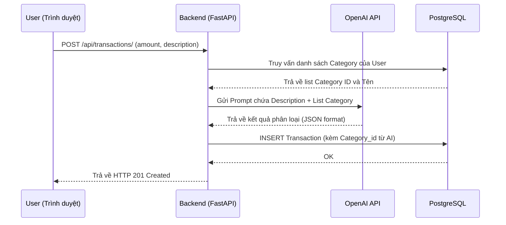

# BÁO CÁO TỔNG KẾT DỰ ÁN MÔN HỌC
**ĐỀ TÀI: XÂY DỰNG HỆ THỐNG QUẢN LÝ CHI TIÊU CÁ NHÂN TÍCH HỢP TRÍ TUỆ NHÂN TẠO**

**TRƯỜNG ĐẠI HỌC [TÊN TRƯỜNG]**  
**KHOA [TÊN KHOA]**

- **Sinh viên thực hiện:** [Tên của bạn], [Tên bạn cùng nhóm nếu có]  
- **Mã số sinh viên:** [MSSV 1], [MSSV 2]  
- **Giảng viên hướng dẫn:** [Tên giảng viên]  
- **Tháng/Năm:** Tháng 8, Năm 2026

---

## LỜI CẢM ƠN
Chúng em xin gửi lời cảm ơn sâu sắc đến Giảng viên [Tên giảng viên] đã tận tình hướng dẫn và định hướng cho chúng em trong suốt quá trình thực hiện đồ án này. Cảm ơn các thầy cô trong Khoa [Tên Khoa] - Trường Đại học [Tên Trường] đã truyền đạt kiến thức quý báu làm nền tảng vững chắc cho chúng em. Đồng thời, chúng em xin cảm ơn gia đình, bạn bè đã luôn động viên, hỗ trợ để nhóm có thể hoàn thành tốt đề tài "Xây dựng Hệ thống Quản lý Chi tiêu Cá nhân tích hợp Trí tuệ Nhân tạo".

---

## CHƯƠNG 1: GIỚI THIỆU TỔNG QUAN

### 1.1. Lý do chọn đề tài và Đặt vấn đề
Quản lý chi tiêu cá nhân là một kỹ năng thiết yếu trong đời sống hiện đại. Tuy nhiên, việc ghi chép thủ công trên sổ sách hoặc bảng tính Excel thường tốn thời gian, dễ gây nhầm lẫn và khó theo dõi xu hướng dài hạn. 

Bên cạnh đó, các ứng dụng quản lý chi tiêu hiện hành trên thị trường chủ yếu dừng lại ở việc cung cấp công cụ lưu trữ (CRUD) và vẽ biểu đồ cơ bản. Người dùng vẫn phải tự chọn danh mục (category) một cách thủ công và tự phân tích dữ liệu của chính mình. Sự thiếu sót này dẫn đến việc người dùng dễ nản chí và bỏ cuộc sau một thời gian ngắn sử dụng.

Nhận thấy vấn đề đó, nhóm quyết định chọn đề tài **"Xây dựng Hệ thống Quản lý Chi tiêu Cá nhân tích hợp Trí tuệ Nhân tạo (ExpenseAI)"**. Việc ứng dụng AI (Mô hình ngôn ngữ lớn - LLMs) vào hệ thống giúp tự động hóa khâu phân loại giao dịch (Categorization) và cung cấp các phân tích, lời khuyên tài chính cá nhân hóa, từ đó giải quyết triệt để điểm nghẽn về trải nghiệm người dùng.

### 1.2. Mục tiêu của đề tài
Đề tài hướng tới việc xây dựng một hệ thống hoàn chỉnh với các mục tiêu cốt lõi sau:
1. **Quản lý dữ liệu tập trung**: Cung cấp nền tảng Web quản lý thu chi an toàn với xác thực JWT HttpOnly, mã hóa bcrypt.
2. **Tự động hóa bằng AI**: Tính năng nhận diện giao dịch thông minh. Người dùng nhập văn bản tự do, AI sẽ trích xuất số tiền và phân loại vào danh mục phù hợp.
3. **Cố vấn tài chính ảo**: Tích hợp AI để phân tích dữ liệu giao dịch hàng tháng, đưa ra cảnh báo hoặc lời khuyên.
4. **Trực quan hóa dữ liệu**: Cung cấp Dashboard và các biểu đồ thống kê (Chart.js) đa dạng.

### 1.3. Phạm vi và đối tượng sử dụng
- **Đối tượng:** Sinh viên, người mới đi làm, hoặc bất kỳ cá nhân nào có nhu cầu kiểm soát tài chính tự động hóa.
- **Phạm vi:** Ứng dụng Web thiết kế dạng Single-Page Application (SPA) responsive trên thiết bị di động.

### 1.4. Công nghệ sử dụng
- **Backend:** Python, FastAPI.
- **Database:** PostgreSQL, SQLAlchemy (ORM), Alembic (Migration).
- **Frontend:** HTML5, CSS3, JavaScript Vanilla, Bootstrap 5, Chart.js.
- **AI Integration:** OpenAI API SDK (GPT-4o-mini).
- **Triển khai:** Docker và Docker-compose.

### 1.5. Phương pháp nghiên cứu
Đồ án được thực hiện theo phương pháp **Phát triển phần mềm linh hoạt (Agile)**. Quá trình bao gồm:
1. **Nghiên cứu lý thuyết**: Tìm hiểu về FastAPI, cơ chế JWT, và cách gọi API của OpenAI.
2. **Khảo sát thực tiễn**: Phân tích hạn chế của các ứng dụng quản lý tài chính hiện tại.
3. **Phát triển và Kiểm thử lặp lại**: Xây dựng từng module (Xác thực, Giao dịch, AI) và liên tục viết test case để đảm bảo chất lượng.

---

## CHƯƠNG 2: PHÂN TÍCH VÀ THIẾT KẾ HỆ THỐNG

### 2.1. Khảo sát hiện trạng và giải pháp
Các hệ thống tương đương trên thị trường như **Mint, MoneyLover, hay Sổ Thu Chi MISA** đều yêu cầu người dùng thao tác rất nhiều bước để lưu 1 giao dịch (chọn ngày, chọn loại, tìm category, nhập số tiền). Việc này lặp đi lặp lại hàng ngày gây mệt mỏi.
**Giải pháp của ExpenseAI:** Chỉ cung cấp duy nhất 1 ô nhập liệu tự do. Ví dụ: nhập "Ăn sáng bát phở 35k". Hệ thống Backend thông qua OpenAI sẽ tự bóc tách:
- Amount: 35000
- Description: Ăn sáng bát phở
- Category: "Ăn uống" (tìm trong bảng danh mục của user).

### 2.2. Yêu cầu hệ thống
- **Yêu cầu chức năng:** Đăng ký/Đăng nhập, Quản lý giao dịch, Quản lý danh mục, Biểu đồ thống kê, Phân loại AI, Tư vấn AI.
- **Yêu cầu phi chức năng:** Rate Limiting chống Brute-force, chống XSS, API response < 300ms.

### 2.3. Sơ đồ và Đặc tả Use Case

*[Hình 2.1: Sơ đồ Use Case của hệ thống - Xem Phụ lục D hoặc File diagrams.md để chèn ảnh draw.io]*

**Bảng Đặc tả Use Case: Thêm giao dịch bằng AI**
| Tiêu chí | Mô tả |
|---|---|
| **Tên Use Case** | Thêm giao dịch tự động qua AI |
| **Actor** | Người dùng đã đăng nhập |
| **Tiền điều kiện** | User đang ở trang Dashboard, hệ thống OpenAI khả dụng |
| **Luồng chính** | 1. User nhập mô tả (VD: "Đổ xăng 50k") vào ô Input.<br>2. Nhấn nút Gửi.<br>3. Backend truyền text qua OpenAI.<br>4. Backend nhận JSON, đối chiếu danh mục và lưu DB.<br>5. Frontend hiển thị Toast thành công và cập nhật số dư. |
| **Luồng ngoại lệ** | - Nếu OpenAI lỗi/timeout: Hiển thị lỗi "Tính năng nhận diện đang bảo trì".<br>- Nếu không phân tích được số tiền: Báo lỗi "Không tìm thấy số tiền". |

### 2.4. Thiết kế Cơ sở dữ liệu (Sơ đồ ERD)

*[Hình 2.2: Sơ đồ ERD Cơ sở dữ liệu - Xem Phụ lục D để chèn ảnh]*

**Đặc tả các bảng chính (Database Schema):**

**Bảng `users` (Thông tin tài khoản)**
| Tên trường | Kiểu dữ liệu | Mô tả |
|---|---|---|
| `id` | INT (PK) | Khóa chính tự tăng |
| `username` | VARCHAR(50) | Tên đăng nhập (Unique) |
| `email` | VARCHAR(255) | Email người dùng (Unique) |
| `hashed_password` | VARCHAR(255) | Mật khẩu đã băm (Bcrypt) |

**Bảng `categories` (Danh mục chi tiêu)**
| Tên trường | Kiểu dữ liệu | Mô tả |
|---|---|---|
| `id` | INT (PK) | Khóa chính |
| `name` | VARCHAR(100) | Tên danh mục (VD: Ăn uống, Lương) |
| `type` | VARCHAR | 'income' hoặc 'expense' |
| `user_id` | INT (FK) | Liên kết với bảng `users` |

**Bảng `transactions` (Giao dịch)**
| Tên trường | Kiểu dữ liệu | Mô tả |
|---|---|---|
| `id` | INT (PK) | Khóa chính |
| `amount` | NUMERIC(10,2) | Số tiền giao dịch |
| `description` | TEXT | Mô tả giao dịch |
| `transaction_date` | DATE | Ngày diễn ra giao dịch |
| `category_id` | INT (FK) | ID danh mục |
| `user_id` | INT (FK) | ID người tạo |

*(Ngoài ra hệ thống còn hỗ trợ phân quyền với bảng `roles`, `permissions` và `user_roles`).*

### 2.5. Sơ đồ Tuần tự (Sequence Diagram) - Luồng gọi AI

Luồng hoạt động khi người dùng yêu cầu AI phân loại giao dịch:



### 2.6. Thiết kế giao diện (Mockup)
Giao diện ứng dụng sử dụng kỹ thuật Glassmorphism (Kính mờ) trên nền Gradient tối màu, mang lại cảm giác hiện đại, sang trọng.

*[Hình 2.3: Ảnh chụp màn hình trang Dashboard ExpenseAI - Vui lòng chèn ảnh chụp màn hình localhost:8000 vào đây]*

---

## CHƯƠNG 3: HIỆN THỰC HỆ THỐNG

### 3.1. Cấu trúc thư mục dự án
Hệ thống tuân thủ kiến trúc phân tầng:
- `alembic/`: Quản lý các version migration của DB.
- `src/api/`: Định nghĩa các API Router.
- `src/models/`: Chứa các class SQLAlchemy Model.
- `src/schemas/`: Chứa các class Pydantic Validation.
- `src/services/`: Chứa logic nghiệp vụ gọi AI.
- `src/templates/`: Các file giao diện HTML/Jinja2.

### 3.2. Danh sách các API Endpoint cốt lõi

| Endpoint | Method | Chức năng |
|---|---|---|
| `/api/auth/login` | POST | Xác thực, trả về Cookie `access_token` & `refresh_token`. |
| `/api/auth/refresh` | POST | Gia hạn token khi token cũ hết hạn (dùng Refresh Token). |
| `/api/transactions/` | GET | Lấy danh sách giao dịch (có phân trang, lọc theo ngày). |
| `/api/transactions/` | POST | Lưu giao dịch mới (Kích hoạt AI nếu category null). |
| `/api/categories/` | GET | Lấy danh sách danh mục theo User hiện tại. |
| `/api/dashboard/summary` | GET | Lấy Tổng thu, Tổng chi, Số dư theo kỳ. |
| `/api/advice/` | POST | Yêu cầu AI đưa ra lời khuyên tài chính. |

### 3.3. Các đoạn Code Snippet trọng tâm

**Snippet 1: Tích hợp AI Advisor (src/api/advice.py)**
Hệ thống gom dữ liệu giao dịch gần nhất của người dùng, làm thành ngữ cảnh (Context) gửi cho AI để xin lời khuyên.
```python
@router.post("/")
def get_ai_advice(db: Session = Depends(get_db), current_user: User = Depends(get_current_user)):
    transactions = db.query(Transaction).filter(Transaction.user_id == current_user.id).limit(30).all()
    if len(transactions) < 5:
        return {"advice": "Hãy thêm ít nhất 5 giao dịch để AI có thể phân tích."}
    
    # Tạo ngữ cảnh từ DB
    tx_text = "\\n".join([f"- {t.transaction_date}: {t.description} ({t.amount}đ)" for t in transactions])
    prompt = f"Dựa vào lịch sử sau, hãy đưa ra 1 lời khuyên tiết kiệm ngắn gọn (dưới 50 chữ):\\n{tx_text}"
    
    response = client.chat.completions.create(
        model="gpt-4o-mini",
        messages=[{"role": "user", "content": prompt}]
    )
    return {"advice": response.choices[0].message.content}
```

**Snippet 2: Frontend Fetch Interceptor xử lý lỗi 401 ngầm (src/templates/base.html)**
Thay vì bắt người dùng đăng nhập lại khi token hết hạn, Frontend bắt lỗi 401 và tự động gọi API Refresh Token.
```javascript
const originalFetch = window.fetch;
window.fetch = async function() {
    let response = await originalFetch.apply(this, arguments);
    if (response.status === 401 && !arguments[0].includes('/login')) {
        const refreshRes = await originalFetch('/api/auth/refresh', { method: 'POST' });
        if (refreshRes.ok) {
            // Token đã được gia hạn qua cookie, gọi lại request cũ
            return originalFetch.apply(this, arguments);
        } else {
            window.location.href = '/login';
        }
    }
    return response;
};
```

---

## CHƯƠNG 4: KIỂM THỬ VÀ ĐÁNH GIÁ

### 4.1. Phương pháp kiểm thử
Dự án áp dụng kiểm thử hồi quy thủ công và kiểm thử hiệu năng. Các cuộc tấn công Brute-force (F5 liên tục trang Login) được dùng để kiểm chứng tính năng bảo mật Rate Limiting (`slowapi`).

### 4.2. Bảng Kịch bản Kiểm thử chi tiết (Test Cases)

| ID | Chức năng | Hành động / Dữ liệu đầu vào | Kết quả mong đợi | Kết quả thực tế |
|---|---|---|---|---|
| TC01 | Auth | Đăng nhập sai mật khẩu | Báo lỗi 401 "Sai username hoặc mật khẩu" | Pass |
| TC02 | Auth | API vượt quá Rate Limit (>10 lần/phút) | HTTP 429 "Too Many Requests" | Pass |
| TC03 | Auth | Đăng nhập hợp lệ | Chuyển trang Dashboard, Token lưu trong Cookie | Pass |
| TC04 | Auth | Truy cập /dashboard không có Cookie | Bị chặn, redirect về /login | Pass |
| TC05 | Category | Xóa danh mục trống | Xóa thành công, hiển thị Toast xanh | Pass |
| TC06 | Category | Xóa danh mục đang có giao dịch | Toast lỗi: "Không thể xóa do có giao dịch" | Pass |
| TC07 | Transaction| Thêm giao dịch 50,000 VND thu nhập | Tổng thu tăng 50K, Số dư tăng 50K | Pass |
| TC08 | Filter | Lọc giao dịch "Tháng này" | Chỉ hiển thị các giao dịch trong tháng | Pass |
| TC09 | AI Input | Nhập "Uống cafe 35k" không chọn danh mục | Giao dịch lưu 35000đ, category "Ăn uống" | Pass |
| TC10 | Security | Nhập mã `<script>alert(1)</script>` | Ứng dụng encode ký tự, chống XSS thành công | Pass |

*(Ghi chú: Lọc 10 test case tiêu biểu do giới hạn độ dài trang).*

### 4.3. Các lỗi phát sinh và quá trình khắc phục
Trong quá trình triển khai, dự án đã đối mặt và xử lý các lỗi sau:
1. **Lỗi bảo mật XSS qua LocalStorage**: Ban đầu Token lưu ở `localStorage` dễ bị script độc hại đánh cắp. **Khắc phục**: Chuyển toàn bộ cơ chế lưu token về `HttpOnly Cookie` từ phía Backend.
2. **Lỗi đồng bộ Schema DB**: Khi thay đổi cấu trúc bảng, DB Postgres bị lỗi khóa ngoại. **Khắc phục**: Tích hợp thư viện `Alembic` để tự động hóa quá trình Migration cơ sở dữ liệu.
3. **Lỗi Spam API OpenAI**: Người dùng click liên tục nút phân loại AI khiến hệ thống hao hụt API quota. **Khắc phục**: Áp dụng Rate Limiting chặn tối đa 10 request/phút/IP.

---

## CHƯƠNG 5: KẾT LUẬN VÀ HƯỚNG PHÁT TRIỂN

### 5.1. Kết quả đạt được
Nhóm đã hoàn thiện hệ thống **ExpenseAI** theo đúng mục tiêu:
- Kiến trúc phần mềm phân tầng rõ ràng (FastAPI + Postgres), khả năng mở rộng cao.
- Bảo mật mạnh mẽ: Chống XSS, SQLi, ứng dụng Refresh Token chuyên nghiệp.
- **Tích hợp thành công AI vào nghiệp vụ**: Phá vỡ khuôn mẫu CRUD thông thường, ứng dụng LLMs vào thực tế để giảm tải thao tác người dùng.

### 5.2. Hạn chế
- Ứng dụng Web trên Mobile chưa mang lại cảm giác mượt mà hoàn hảo như App Native.
- Phụ thuộc vào API của OpenAI dẫn đến độ trễ (latency) khoảng 1-2 giây khi thêm giao dịch bằng AI.

### 5.3. Hướng phát triển tương lai
1. **Phát triển Mobile App (React Native/Flutter)**: Cài đặt trực tiếp lên điện thoại, hỗ trợ Push Notifications nhắc nhở nhập chi tiêu hàng ngày.
2. **Quét hóa đơn (Vision AI)**: Kế thừa nền tảng AI hiện tại, bổ sung mô-đun đọc chữ trên ảnh (OCR) để nhập hóa đơn từ máy ảnh.
3. **Kết nối Ngân hàng (Open Banking)**: Tự động tải giao dịch từ thẻ tín dụng về hệ thống.

### 5.4. Bài học kinh nghiệm
Thông qua đồ án, nhóm đã rèn luyện được tư duy hệ thống, hiểu sâu về kiến trúc Web bất đồng bộ và biết cách xử lý các bài toán bảo mật Token trong thực tế doanh nghiệp. Quan trọng nhất là cách thức áp dụng các công cụ AI (như ChatGPT API) vào giải quyết một nghiệp vụ truyền thống.

---

## TÀI LIỆU THAM KHẢO
1. Sebastián Ramírez. *FastAPI Documentation*. URL: https://fastapi.tiangolo.com/  
2. Mike Bayer. *SQLAlchemy Documentation*. URL: https://docs.sqlalchemy.org/  
3. OpenAI. *OpenAI API Reference & Prompt Engineering*. URL: https://platform.openai.com/docs/api-reference  
4. Chart.js Contributors. *Chart.js Documentation*. URL: https://www.chartjs.org/docs/latest/  
5. Auth0. *JWT and Token Security Best Practices*. URL: https://auth0.com/learn/json-web-tokens/
6. Miguel Grinberg. *Alembic Database Migrations*. URL: https://alembic.sqlalchemy.org/
7. OWASP. *Cross Site Scripting (XSS) Prevention Cheat Sheet*. URL: https://cheatsheetseries.owasp.org/
8. MDN Web Docs. *Fetch API*. URL: https://developer.mozilla.org/en-US/docs/Web/API/Fetch_API
9. Docker Inc. *Docker Compose Overview*. URL: https://docs.docker.com/compose/
10. Bootstrap Team. *Bootstrap 5 Documentation*. URL: https://getbootstrap.com/docs/5.0/

---

## PHỤ LỤC

### Phụ lục A: Hướng dẫn Cài đặt và Khởi chạy
Yêu cầu hệ thống: Máy tính cài sẵn Docker và Docker-compose.
1. Clone dự án về máy tính.
2. Sao chép cấu hình môi trường: `cp .env.example .env` (và điền API Key OpenAI).
3. Khởi chạy hệ thống: `docker-compose up --build -d`
4. Cập nhật cơ sở dữ liệu: `docker-compose exec web alembic upgrade head`
5. Truy cập giao diện tại: `http://localhost:8000`

### Phụ lục B: File Cấu hình mẫu (.env.example)
```env
# Database Configuration
POSTGRES_USER=expenseuser
POSTGRES_PASSWORD=expensepass
POSTGRES_DB=expense_db
DATABASE_URL=postgresql://expenseuser:expensepass@db:5432/expense_db

# Security Configuration
SECRET_KEY=yoursecretkeyhere_min_32_chars
ALGORITHM=HS256

# OpenAI Integration
OPENAI_API_KEY=sk-proj-xxxxxxxxxxxxxxxxxxx
```

### Phụ lục C: Thư viện sử dụng (requirements.txt)
```text
fastapi==0.104.1
uvicorn==0.24.0
sqlalchemy==2.0.23
psycopg2-binary==2.9.9
pydantic==2.5.2
pydantic-settings==2.1.0
passlib[bcrypt]==1.7.4
python-jose[cryptography]==3.3.0
python-multipart==0.0.6
openai==1.3.5
slowapi==0.1.8
jinja2==3.1.2
alembic==1.13.0
```
