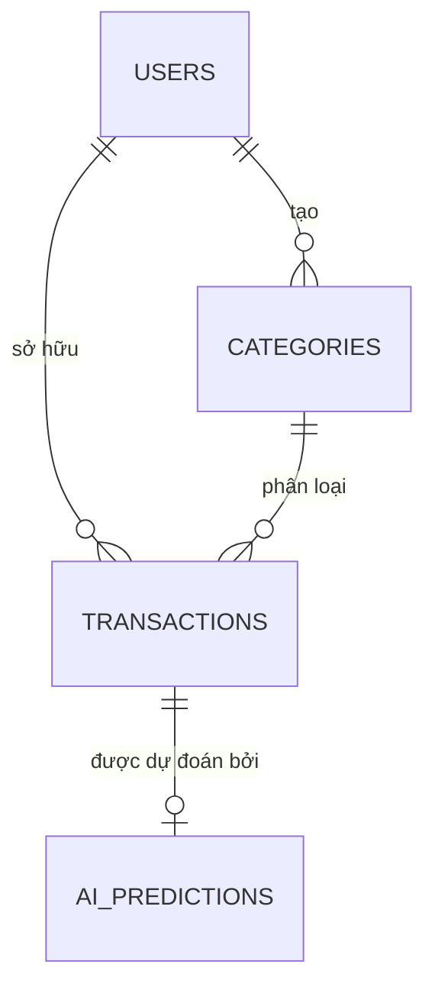

# THIẾT KẾ CƠ SỞ DỮ LIỆU
**Tên ứng dụng:** Hệ thống Quản lý Chi tiêu Cá nhân tích hợp AI
**Nhóm:** 02 (Trưởng nhóm: Nguyễn Tuấn Đạt, Phó nhóm: Phàn Ngọc Anh)
**Giai đoạn:** Tuần 4-5 (Bài KT 1)

---

## 1. THIẾT KẾ CƠ SỞ DỮ LIỆU QUAN HỆ
Hệ thống sử dụng **PostgreSQL/SQLite** kết hợp thư viện ORM **SQLAlchemy 2.0**. Gồm 4 thực thể chính.

### 1.1. Bảng `users` (DB-TBL-001)
Lưu thông tin đăng nhập và danh tính người dùng.
- `id` (Integer): Khóa chính, tự động tăng.
- `username` (String): Unique, Not Null. Tên đăng nhập.
- `password_hash` (String): Not Null. Mật khẩu đã được mã hóa bằng Bcrypt.
- `role` (String): Mặc định là "user".

### 1.2. Bảng `categories` (DB-TBL-002)
Lưu danh sách các thư mục phân loại giao dịch (Ăn uống, Tiền lương, v.v.).
- `id` (Integer): Khóa chính.
- `name` (String): Not Null.
- `type` (String): Phân loại thu (IN) hoặc chi (OUT).
- `user_id` (Integer): Khóa ngoại tham chiếu `users.id`. Tùy chỉnh danh mục theo từng cá nhân.

### 1.3. Bảng `transactions` (DB-TBL-003)
Lưu dữ liệu cốt lõi về thu/chi.
- `id` (Integer): Khóa chính.
- `amount` (Float): Số tiền giao dịch. Not Null.
- `description` (String): Mô tả giao dịch.
- `date` (DateTime): Thời gian thực hiện, mặc định `func.now()`.
- `category_id` (Integer): Khóa ngoại tham chiếu `categories.id`.
- `user_id` (Integer): Khóa ngoại tham chiếu `users.id`.

### 1.4. Bảng `ai_predictions` (DB-TBL-004)
Lưu lại lịch sử dự đoán của AI (Dữ liệu Audit AI).
- `id` (Integer): Khóa chính.
- `tx_id` (Integer): Khóa ngoại tham chiếu `transactions.id` (1-to-1).
- `predicted_category` (String): Chuỗi tên danh mục mà AI dự đoán.
- `confidence` (Float): Độ tự tin của AI (0.0 -> 1.0).

## 2. CÁC RÀNG BUỘC TOÀN VẸN (INTEGRITY CONSTRAINTS)
- **Constraint Foreign Key (Cascade Delete):** Nếu một `user` bị xóa, toàn bộ `categories` và `transactions` của họ phải tự động bị xóa theo `ondelete='CASCADE'`. Điều này đảm bảo Database không bao giờ chứa "dữ liệu rác mồ côi".
- **Unique Constraint:** `users.username` bắt buộc phải là duy nhất trên toàn hệ thống. Không cho phép đăng ký trùng lặp.
- **Data Type Safety:** Field `amount` bắt buộc là kiểu Float (hoặc Numeric) để tính toán chuẩn xác, không được để kiểu String.

## 3. SƠ ĐỒ THỰC THỂ LIÊN KẾT (ERD) MỨC LOGIC
*(Biểu diễn mô phỏng)*

