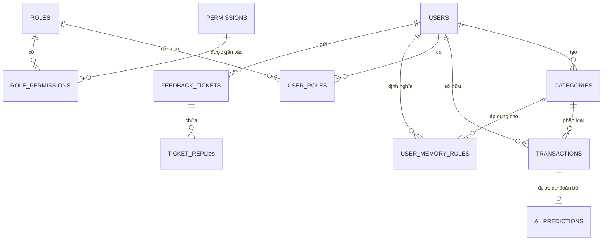

# THIẾT KẾ CƠ SỞ DỮ LIỆU
**Tên ứng dụng:** Hệ thống Quản lý Chi tiêu Cá nhân tích hợp AI
**Nhóm:** 02 (Trưởng nhóm: Nguyễn Tuấn Đạt, Phó nhóm: Phàn Ngọc Anh)
**Giai đoạn:** Tuần 4-5 (Bài KT 1)

---

## 1. THIẾT KẾ CƠ SỞ DỮ LIỆU QUAN HỆ (DATA DICTIONARY)
Hệ thống sử dụng **PostgreSQL/SQLite** kết hợp thư viện ORM **SQLAlchemy 2.0**. Schema hiện hành có **11 bảng** cốt lõi như sau:

### 1.1. Bảng Core & Authentication
1. **`users`**: Lưu thông tin đăng nhập và danh tính (id, username, email, hashed_password, created_at).
2. **`roles`**: Danh mục phân quyền (id, name, description).
3. **`permissions`**: Quyền hạn chi tiết trên hệ thống (id, name, resource, action).
4. **`user_roles`**: Bảng trung gian n-n nối User và Role (id, user_id, role_id, assigned_at).
5. **`role_permissions`**: Bảng trung gian n-n nối Role và Permission (id, role_id, permission_id).

### 1.2. Bảng Nghiệp vụ Thu Chi
6. **`categories`**: Danh mục thu/chi (id, name, type, color, user_id, is_system).
7. **`transactions`**: Giao dịch tài chính (id, user_id, category_id, amount, description, transaction_date).

### 1.3. Bảng AI & Trí tuệ nhân tạo
8. **`ai_predictions`**: Lưu lại lịch sử dự đoán của AI cho mục đích audit (id, transaction_id, predicted_category, confidence).
9. **`user_memory_rules`**: Hệ thống bộ nhớ AI ghi nhớ thói quen người dùng (id, user_id, keyword_pattern, category_id, frequency).

### 1.4. Bảng Chăm sóc khách hàng (Feedback)
10. **`feedback_tickets`**: Phiếu hỗ trợ/góp ý từ người dùng (id, user_id, subject, message, topic, status).
11. **`ticket_replies`**: Các lượt phản hồi trong phiếu hỗ trợ (id, ticket_id, user_id, message).

## 2. CÁC RÀNG BUỘC TOÀN VẸN (INTEGRITY CONSTRAINTS)
- **Constraint Foreign Key (Cascade Delete):** Nếu một `user` bị xóa, các `transactions`, `user_roles`, `user_memory_rules` và `feedback_tickets` của họ tự động bị xóa (`ondelete='CASCADE'`).
- **Unique Constraint:** `users.username` và `users.email` bắt buộc duy nhất trên toàn hệ thống. Bảng `categories` có unique trên (`user_id`, `name`, `type`).
- **Data Type Safety:** `amount` trong `transactions` là kiểu Numeric(10,2) và có Check Constraint `amount > 0`.

## 3. SƠ ĐỒ THỰC THỂ LIÊN KẾT (ERD) MỨC LOGIC

```mermaid
erDiagram
    USERS ||--o{ CATEGORIES : "tạo"
    USERS ||--o{ TRANSACTIONS : "sở hữu"
    USERS ||--o{ USER_ROLES : "có"
    ROLES ||--o{ USER_ROLES : "gắn cho"
    ROLES ||--o{ ROLE_PERMISSIONS : "có"
    PERMISSIONS ||--o{ ROLE_PERMISSIONS : "được gắn vào"
    CATEGORIES ||--o{ TRANSACTIONS : "phân loại"
    TRANSACTIONS ||--o| AI_PREDICTIONS : "được dự đoán bởi"
    USERS ||--o{ USER_MEMORY_RULES : "định nghĩa"
    CATEGORIES ||--o{ USER_MEMORY_RULES : "áp dụng cho"
    USERS ||--o{ FEEDBACK_TICKETS : "gửi"
    FEEDBACK_TICKETS ||--o{ TICKET_REPLies : "chứa"
```
