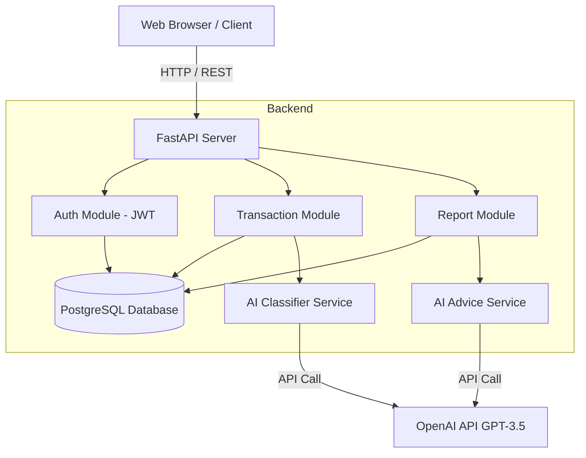
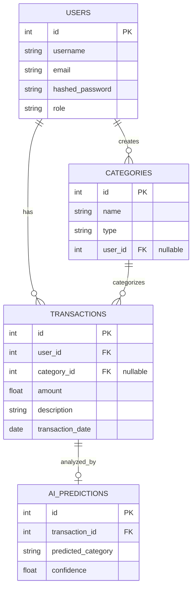

# Tài liệu Phân tích và Thiết kế Hệ thống: Expense Manager AI

## Mục lục
1. [Giới thiệu](#1-giới-thiệu)
2. [Phân tích bài toán](#2-phân-tích-bài-toán)
3. [Yêu cầu chức năng](#3-yêu-cầu-chức-năng)
4. [Yêu cầu phi chức năng](#4-yêu-cầu-phi-chức-năng)
5. [Actor và Use Case](#5-actor-và-use-case)
6. [Thiết kế kiến trúc hệ thống](#6-thiết-kế-kiến-trúc-hệ-thống)
7. [Thiết kế cơ sở dữ liệu](#7-thiết-kế-cơ-sở-dữ-liệu)
8. [Xác định vị trí AI](#8-xác-định-vị-trí-ai)
9. [Thiết kế prompt và luồng gọi AI](#9-thiết-kế-prompt-và-luồng-gọi-ai)
10. [Kế hoạch triển khai](#10-kế-hoạch-triển-khai)

---

## 1. Giới thiệu
Tài liệu này mô tả chi tiết các phân tích nghiệp vụ, yêu cầu phần mềm, cấu trúc dữ liệu và thiết kế kiến trúc cho dự án **Expense Manager AI**. Hệ thống giúp người dùng cá nhân quản lý tài chính dễ dàng thông qua việc tự động hóa phân loại giao dịch và cung cấp lời khuyên tài chính cá nhân hóa nhờ sự hỗ trợ của Trí tuệ nhân tạo (OpenAI).

## 2. Phân tích bài toán

- **Bối cảnh:** Việc quản lý tài chính cá nhân ngày càng trở nên quan trọng. Tuy nhiên, việc ghi chép thủ công tốn thời gian, người dùng thường lười phân loại giao dịch và thiếu kiến thức để tự tối ưu chi tiêu.
- **Người dùng:** Cá nhân muốn theo dõi thu chi hàng ngày, cải thiện tình hình tài chính, những người không rành về kế toán.
- **Dữ liệu:** Số tiền, mô tả giao dịch, ngày tháng, danh mục thu/chi.
- **Quy trình hiện tại:** Nhập thủ công -> Tự phân loại -> Tự tổng hợp -> Nhìn số liệu mà không biết phải làm gì tiếp theo.
- **Vấn đề cần giải quyết:** Giảm thiểu thao tác nhập liệu (AI tự phân loại), cung cấp góc nhìn tổng quan (Báo cáo trực quan) và đưa ra gợi ý hành động (AI tư vấn).

## 3. Yêu cầu chức năng

1. **Quản lý Tài khoản (Auth):**
   - Đăng ký tài khoản mới.
   - Đăng nhập và nhận JWT token.
   - Quản lý phân quyền (Admin / User).
2. **Quản lý Danh mục (Category):**
   - Xem danh sách danh mục (bao gồm mặc định của hệ thống và tự tạo).
   - Thêm, sửa, xóa danh mục cá nhân. (Không cho phép xóa nếu đang có giao dịch liên quan).
3. **Quản lý Giao dịch (Transaction):**
   - Ghi nhận khoản thu/chi (Số tiền, Mô tả, Ngày).
   - Tự động phân loại danh mục thông qua AI nếu người dùng bỏ trống danh mục.
   - Xem lịch sử giao dịch, sửa, xóa giao dịch.
4. **Báo cáo và Thống kê (Reports):**
   - Xem Dashboard tổng quan: Tổng thu, tổng chi, số dư theo tháng.
   - Xem báo cáo phân bổ chi tiêu theo từng danh mục.
5. **AI Hỗ trợ (AI Features):**
   - Tự động nhận diện danh mục dựa trên đoạn text mô tả.
   - Cung cấp lời khuyên tài chính cá nhân dựa trên thói quen chi tiêu 3 tháng gần nhất.

## 4. Yêu cầu phi chức năng

- **Bảo mật:** Mật khẩu phải được băm (Bcrypt). Dữ liệu cá nhân (giao dịch) được cách ly tuyệt đối giữa các user bằng JWT. Không gửi thông tin chi tiết từng giao dịch lên AI, chỉ gửi con số tổng hợp. API Key không được lưu cứng trong code.
- **Hiệu năng:** Thời gian phản hồi API (không qua AI) dưới 500ms. Gọi AI có timeout rõ ràng để không làm treo hệ thống.
- **Khả năng bảo trì:** Code tuân thủ PEP8, có docstring, phân chia thư mục (MVC/Router pattern) rõ ràng.
- **Triển khai:** Hỗ trợ Docker container hóa với Docker Compose.

## 5. Actor và Use Case

- **User (Người dùng thường):** Thực hiện quản lý thu chi, xem báo cáo, xin lời khuyên AI.
- **Admin:** Quản trị viên, có thể chỉnh sửa/xóa các danh mục hệ thống và quản lý user.
- **System (AI):** Actor phụ, tự động phân loại text và sinh lời khuyên.

```mermaid
usecaseDiagram
    actor User
    actor Admin
    actor "OpenAI (AI System)" as AI

    User --> (Đăng ký / Đăng nhập)
    User --> (Quản lý Danh mục)
    User --> (Quản lý Giao dịch)
    User --> (Xem Báo cáo Tổng quan)
    User --> (Nhận lời khuyên tài chính)

    Admin --> (Quản lý Danh mục hệ thống)
    
    (Quản lý Giao dịch) .> (Tự động phân loại giao dịch) : include
    (Tự động phân loại giao dịch) --> AI
    (Nhận lời khuyên tài chính) --> AI
```

## 6. Thiết kế kiến trúc hệ thống

Hệ thống được thiết kế theo mô hình Client - Server và Microservices (tích hợp API bên thứ 3).

- **Frontend:** Trình duyệt web render file HTML (Jinja2) kết hợp Javascript Fetch API.
- **Backend:** FastAPI Framework (Python).
- **Database:** PostgreSQL (Môi trường thật) hoặc SQLite (Test/Dev).
- **AI Service:** Tương tác với OpenAI thông qua thư viện `openai`.



## 7. Thiết kế cơ sở dữ liệu

Sử dụng cơ sở dữ liệu quan hệ (RDBMS) qua SQLAlchemy ORM.

### Bảng dữ liệu chính:
1. **users:** Lưu thông tin tài khoản (id, username, email, hashed_password, role).
2. **categories:** Lưu danh mục thu chi (id, name, type, user_id).
3. **transactions:** Lưu lịch sử giao dịch (id, user_id, category_id, amount, description, transaction_date).
4. **ai_predictions:** Lưu lịch sử dự đoán của AI để đánh giá độ chính xác (id, transaction_id, predicted_category, confidence).

### Entity Relationship Diagram (ERD)


## 8. Xác định vị trí AI

Trong dự án này, AI được đặt ở hai vị trí mang lại giá trị cao nhất cho trải nghiệm người dùng:
1. **Tiền xử lý dữ liệu (Data Entry):** Quá trình nhập liệu trở nên siêu nhanh. Người dùng chỉ cần nhập số tiền và nội dung (VD: "Ăn trưa 50k"), AI sẽ tự gán danh mục "Ăn uống". Giải quyết bài toán lười phân loại của người dùng.
2. **Phân tích cấp cao (Advisory):** Báo cáo con số thường khô khan. Việc AI đọc các con số này và diễn dịch ra thành "Lời khuyên" giúp người dùng có định hướng hành động (VD: "Bạn đang chi quá nhiều cho Ăn uống, hãy thử tự nấu ăn ở nhà").

## 9. Thiết kế prompt và luồng gọi AI

### 9.1. Prompt Phân loại Giao dịch (AI Classifier)
- **Kỹ thuật:** Zero-shot prompting kết hợp ép kiểu JSON output.
- **System Prompt:**
  > "Bạn là chuyên gia phân loại chi tiêu. Hãy phân loại giao dịch sau vào một trong các danh mục: Ăn uống, Di chuyển, Mua sắm, Hóa đơn, Giải trí, Sức khỏe, Giáo dục, Khác. Chỉ trả về JSON duy nhất có dạng `{"category": "Tên_Danh_Mục", "confidence": 0.95}`."
- **User Prompt:** `{Nội dung người dùng nhập}`

### 9.2. Prompt Tư vấn Tài chính (AI Advice)
- **Kỹ thuật:** Contextual Prompting (cung cấp bối cảnh là dữ liệu tổng hợp thay vì chi tiết).
- **System Prompt:**
  > "Bạn là một chuyên gia tư vấn tài chính cá nhân chuyên nghiệp, thấu cảm và thực tế. Dựa trên bảng tóm tắt thu chi tổng quan trong 3 tháng qua của người dùng, hãy đưa ra lời khuyên tài chính ngắn gọn (dưới 200 chữ), dễ hiểu và mang tính hành động cao."
- **User Prompt:**
  > "Đây là tóm tắt dữ liệu tài chính 3 tháng gần nhất của tôi: `{financial_summary_json}`. Xin hãy cho tôi lời khuyên."

## 10. Kế hoạch triển khai

- **Giai đoạn 1 (Development):** Cài đặt môi trường Python 3.10+, xây dựng hệ thống Models, DB Schema. Triển khai API CRUD cơ bản. (Hoàn thành)
- **Giai đoạn 2 (AI Integration):** Nhúng module OpenAI API. Viết các logic dự phòng (Fallback) khi AI bị timeout hoặc lỗi mạng. (Hoàn thành)
- **Giai đoạn 3 (Frontend & Testing):** Thiết kế giao diện Jinja2/Bootstrap, tích hợp Chart.js. Viết unit test bằng Pytest phủ toàn bộ API. (Hoàn thành)
- **Giai đoạn 4 (Deployment):** Đóng gói ứng dụng thành Docker Container (Sử dụng Multi-stage build). Cấu hình docker-compose triển khai thực tế trên VPS/Cloud (AWS/DigitalOcean) kèm PostgreSQL.
